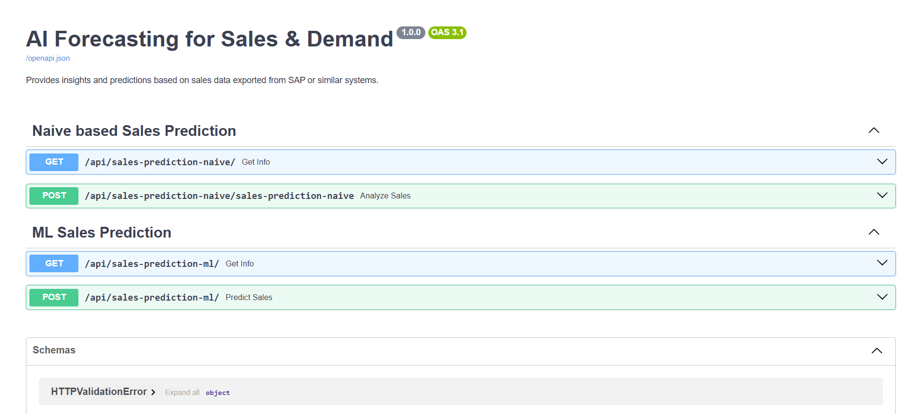

# ai-forecast-tool
To do analysis by using python, we will use dataset from Kaggle or sample data exported from SAP and we will analyse the demand by using opensource libraries and predict the forecast.

# SE16N_MARA
Refers to using the SAP transaction code SE16N to access and view data from the MARA table.

# SalesOrderReport
Sales Order report (often accessed via transaction code VA05 or VA05N) provides a list of sales orders based on specified criteria. 

# FinanceReport
Financial Reports provide a comprehensive view of a company's financial health, performance, and position. These reports, generated within SAP systems, are crucial for internal analysis, external reporting, and decision-making. Common reports include Balance Sheets, Profit & Loss Statements, Cash Flow Statements, and Trial Balances. 

# MaterialMasterDetail
Material Master is a central repository of data about materials used in a company. It contains all the information needed for managing materials across different business processes, such as purchasing, inventory management, production, and sales.

# Run App
uvicorn main:app --reload
python -m uvicorn main:app --reload

http://localhost:8000

# Swagger Api Documentation
http://localhost:8000/docs

